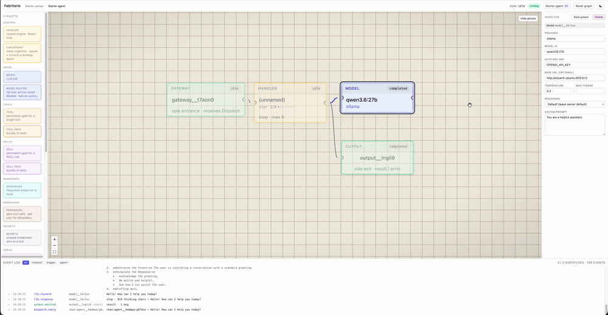

# Fabritorio

<p align="center">
  
</p>

**An agent factory — assemble the parts, watch it run.**

A local-first visual environment for building AI agents. Drop the parts on a canvas, wire them, and watch every LLM call, tool call, and reply flow across the wires live.

## Why

The bet is on your creativity. Give people composable primitives and a canvas and they engineer things no form would ever let them build — the same impulse behind a sprawling Factorio blueprint or a Minecraft redstone machine, pointed at agents.

Fabritorio makes that possible by making the runtime _the graph_. A handler, its model, tools, skills, memory — all nodes and edges you can see, drill into, and rewire. Nothing is implicit; the graph is the program. Stamp down a copy, rewire a node, and you've got a new agent in minutes. And because it runs against your own local models, tokens stop being the meter — over-build freely.

## Quickstart

### Sandbox (Docker)

Fastest and safest — everything runs in an isolated container that can't reach your machine. Needs only Docker.

```sh
docker compose up --build
```

### Run locally

Needs Node.js 24 (`.nvmrc`) and pnpm 9+.

```sh
pnpm install
pnpm start          # build, then serve the whole app on :4000
```

Either way, open <http://localhost:4000> and create a graph. The UI and runner share that one port, bound to loopback.

**Models.** No key needed to boot. For a **local** model (Ollama, vLLM, LM Studio), set the Model node's `base_url` in the inspector. For a **hosted** model, supply the key your Model node references — in a repo-root `.env` locally, or under `environment:` in `docker-compose.yml`:

```sh
echo "OPENAI_API_KEY=sk-..." >> .env     # or ANTHROPIC_API_KEY, GEMINI_API_KEY
```

Hacking on Fabritorio itself? `pnpm dev` splits the web UI (:3000, hot-reload) from the runner (:4000).

## Build your first agent

1. **Create a new graph** from the picker. You land on the **Starter canvas**: a single Agent, already complete — it references a starter agent graph (Gateway → Handler → Model + Output). Nothing to wire.
2. **Chat with it** — click the Agent and the inspector shows **Conversations / New chat**. Open a new chat and a panel opens scoped to that agent. Send a message and watch the dispatch animate across the canvas; tool calls render inline above each reply.
3. **Point it at a model** — select the Agent (or drill in) and set the provider, model id, and for a local endpoint the `base_url`.
4. **Drill in** — double-click the Agent to enter its agent graph and rewire how it thinks: swap the model, attach tools, change the handler.
5. **Customize — skills _and_ tools** — wire a `Skill` for domain behaviour (the _how_ and _when_); add a runtime **tool** for a new capability (the _what_). Two agents that differ by domain — a coder vs. a SQL assistant — share the same stock tools; the delta is a wired skill. New tools are authored by the built-in **tool-builder** and show up in the tool picker like any built-in.

For a node-by-node walkthrough of everything you can wire — every node, when to reach for it, and the knobs that matter — see the [**node reference**](./docs/node-reference.md). For ready-made patterns (a loop detector, a context compactor, scheduled runs, adding a tool), see the [**recipes**](./docs/recipes.md).

## Canvas basics

A handful of gestures you'll use on every canvas.

| Gesture                      | Does                                                                                                          |
| ---------------------------- | ------------------------------------------------------------------------------------------------------------- |
| Click a node                 | Selects it — the inspector on the right follows the selection. Click empty space to deselect.                 |
| ⌘/Ctrl-click a node          | Adds it to (or removes it from) the current selection — build a multi-selection one node at a time.           |
| Shift-drag a box             | Selects several nodes at once; with two or more selected, the rest of the canvas dims.                        |
| Double-click a node          | Drills into what it references — an agent, a handler, a tool/skill pack. Use the breadcrumb to step back out. |
| Delete / Backspace           | Removes the selected node or edge. There's no undo, so it commits immediately.                                |
| Scroll · drag the background | Zoom · pan. The corner controls also zoom and fit the graph to the viewport.                                  |
| ⌘/Ctrl + C · X · V           | Copy · cut · paste. Paste drops a fresh copy nearby, and only into a canvas of the same kind.                 |

**Saving a preset.** Select two or more nodes and press ⌘/Ctrl+Shift+S — or click the "Save N nodes as preset" button that appears — to save them to your library as a reusable preset; you'll be asked for a name. For a single node, use the inspector's "Save as preset" button. Presets drop by value: dropping one stamps a fresh copy, and later edits to the template don't reach copies already on a canvas.

**The library.** Saved presets and the system seeds (Foreman, the builders, the starters) live below the parts in the palette; drag any onto a canvas of the matching kind. Once it holds more than a few entries, a "Search library…" box appears — matching name and description — alongside a Sort toggle (Name or Modified). Right-click one of _your own_ entries to Rename or Delete it; the system presets are locked, drag-only with no menu.

## Contributing

Checkout [`CONTRIBUTING`](./CONTRIBUTING.md)

## Status & license

Early and solo-built, local-first, single-user, no hosted dependency. Issues and ideas welcome.

[Checkout the build log at fabritorio.dev/blog](https://fabritorio.dev/blog/) as I document my dogfooding and iterations of the project.

**No warranty.** Fabritorio is provided **as is**, with no support guarantee and no commitment to ongoing maintenance; the author accepts no liability for its use. Run it at your own risk — and that risk is worth naming: it executes model-driven tools, code, and shell commands on your machine, and can make outbound network calls. Run it only somewhere you're willing to expose to that, and review what your agents are wired to do.

Licensed under MIT — see [`LICENSE`](./LICENSE). Take it, fork it, build on it.
