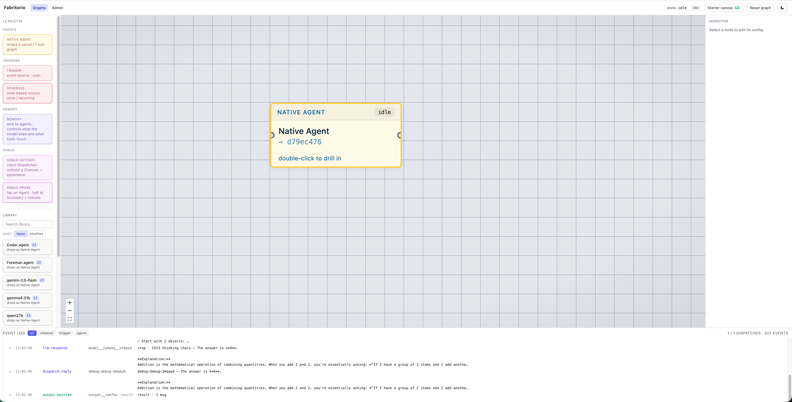
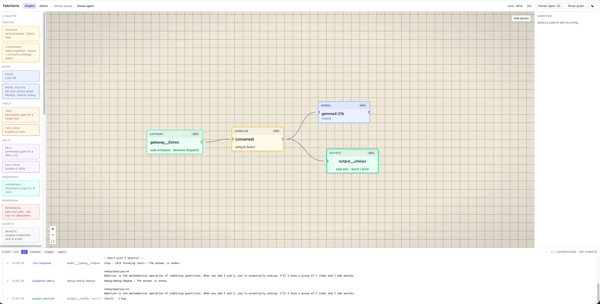
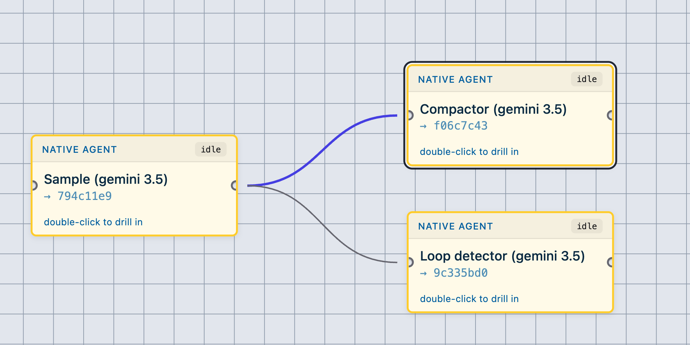
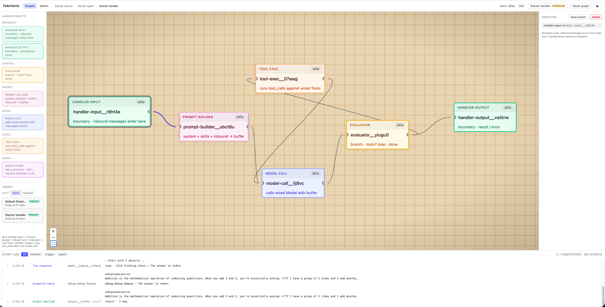

# Nodes

A field guide to the nodes you'll wire on the canvas. The [README](../README.md) gets your first agent running; this is the reference you keep open while you build — what each node does, when to reach for it, and the knobs that matter.

## Contents

- [One graph, three views](#one-graph-three-views)
- [L2 — the orchestration canvas](#l2--the-orchestration-canvas)
    - [Native Agent](#native-agent) · [Triggers](#triggers) · [Memory](#memory) · [Debug](#debug) · [From the library](#from-the-library)
- [L1 — inside an agent](#l1--inside-an-agent)
    - [Handler](#handler) · [Ghosts](#ghosts) · [Model & Model Router](#model--model-router) · [Tools & Tool Packs](#tools--tool-packs) · [Skills & Skill Packs](#skills--skill-packs) · [Workspace](#workspace) · [Permission](#permission) · [Secrets](#secrets) · [Checkpoint](#checkpoint)
- [L0 — inside a handler](#l0--inside-a-handler)
- [Extending — tools & skills](#extending--tools--skills)
- [Pre-built & system nodes](#pre-built--system-nodes)
    - [Starters](#starters) · [System agents](#system-agents) · [Built-in tools](#built-in-tools) · [System skills](#system-skills)

---

## One graph, three views

It's one graph. A node can open into a subgraph, which can open into another — same canvas, same nodes, same two kinds of wire all the way down. There is no "layer" the runtime switches on.

But "L2 / L1 / L0" is useful shorthand for _which view you're looking at_, and you'll see the labels in the UI and in conversation, so they're worth keeping:

- **L2** — the **orchestration canvas**. The top-level graph that owns everything else: triggers, the agents you chat with, the memory attached to them.
- **L1** — **inside an agent**. Double-click an agent and you drop into its wiring: a handler, a model, the tools and skills it can reach.
- **L0** — **inside a handler**. Drill one level deeper and you're looking at the reasoning loop itself, broken into primitives.

**Two kinds of wire** carry everything, at every level:

- **Reference wires** attach a dependency — a Tool to a Handler, a Memory to an Agent. The wire means "X is available to Y."
- **Event wires** carry messages across a boundary — a Trigger firing an Agent, an Agent replying to a chat. The wire means "X sends to Y."

Anything you drop from the **library** (a tool pack, a saved agent, a system agent) lands as a **copy** — your instance is yours to edit, and editing the library template never reaches back into copies already on a canvas.

---

## L2 — the orchestration canvas

<p align="center">
  
</p>

This is where you start. You wire event sources to agents and hang state off them. Four things live here.

### Native Agent

The agent you chat with and drill into — a saved agent graph embedded as a single node. This is called “native” because the original plan was to support bring-your-own-harness with support for any CLI invocable agent, or Pi. Right now they are still floating in the BE but hid it from the FE palette for now until I can flesh out how to integrate them fully.

When this agent is wired to another agent, you expose it as an `ask_agent_<name>`. The **description** is useful there as that will be the tool description for the caller.

An agent forgets between chats unless you attach a [Memory](#memory) — within a single exchange it tracks its own tool-call loop, but the next dispatch starts clean.

> You won't find a **Channel** in the palette. When you open a chat with an agent, the runner mints one as a hidden sidecar and wires it for you. Chatting is just an event wire you didn't have to draw.

### Triggers

An agent runs when something dispatches a message to it. A **Trigger** is that something when it isn't a human typing — a clock, an HTTP call, an internal event. It fires one-way (no reply path) and fabricates the inbound message from its **instructions** field. Pick a kind:

| Kind       | Fires on                               | Configure with                                                                                     | Status       |
| ---------- | -------------------------------------- | -------------------------------------------------------------------------------------------------- | ------------ |
| `cron`     | a cron schedule                        | `expression` (standard cron)                                                                       | landed ✅    |
| `schedule` | a one-shot time or a recurring cadence | `at` (ISO time), or `recurrence` = interval / daily / weekly, optionally bounded by `from`/`until` | landed ✅    |
| `webhook`  | an HTTP request                        | `path` + `method`, mounted under `/triggers/<path>`                                                | not live yet |
| `event`    | an internal bus topic                  | `topic`                                                                                            | not live yet |
| `manual`   | you clicking _fire_                    | nothing                                                                                            | not live yet |

Set `paused` to keep a trigger on the canvas without it firing.

### Memory

By default an agent is **stateless across dispatches**. A dispatch is one inbound message and the whole loop it kicks off — within that loop the Handler keeps the full buffer (every tool call, every result, the running back-and-forth) so the agent reasons with complete context until it replies. What it _doesn't_ carry is anything from the dispatch before: the next message starts fresh. A Memory node is how you give it continuity across dispatches.

It's state you hang off an agent. One node, three independent dials — set one value on each and they compose:

- **What it stores** (`storage_kind`): a keyed store (`kv`, used for conversation history), a single editable `markdown` blob, or inline `static_string` text on the node.
- **How it reaches the prompt** (`handling`): `none` (tool-only), `always_inject` (prepend every turn), `full_history` (replay all), `last_n` (replay the last _n_ turns, default 20), or `last_within_tokens` (replay the tail under a token budget, default 8192).
- **Whether the agent can edit it** (`tool_access`): `none`, `read`, or `read_write` via the `memory_read` / `memory_write` tools. Only meaningful for `markdown`.

Storage is `in_memory` (ephemeral) or `local_storage` (file-backed under `~/.fabritorio/memory/`). The dials are orthogonal, but a few combinations are the ones you'll actually use:

| You want…                           | storage_kind    | handling        | tool_access  |
| ----------------------------------- | --------------- | --------------- | ------------ |
| Conversation history                | `kv`            | `last_n`        | `none`       |
| A fixed persona / system context    | `static_string` | `always_inject` | `none`       |
| A notes file the agent maintains    | `markdown`      | `always_inject` | `read_write` |
| A scratchpad it reads back mid-task | `markdown`      | `none`          | `read_write` |

> I plan to write an excessive separate document on my rationale for this. Long story short, I think this is a separate axis than what a harness should do. Memory for LLM is basically just what `message[]` is so far. If we can separate that then we can support any harness that freely allows that interface.

### Debug

Two nodes for poking at a graph while it runs; both work here and inside an agent.

- **Debug Gateway** stands in for a Channel or Trigger — drop it, type into the inspector, and drive the wired agents by hand without setting up a real source.
- **Debug Probe** taps any node and halts execution at its boundary so you can inspect the in-flight state, then resume. `haltOn` picks `pre` / `post` / `both`.

### From the library

The palette's library holds **pre-built agents** you can drop and chat with immediately — the **Tool Builder**, the **Skill Builder**, the **Foreman**, and a generic **Coder**. Drop one next to your own agent and wire an edge to delegate to it. These, the starter templates, and the built-in tools they use are all covered in [Pre-built & system nodes](#pre-built--system-nodes).

---

## L1 — inside an agent

<p align="center">
  
</p>

Double-click an agent and you're inside it. The shape is always **Gateway → Handler → Output**: dispatches enter at the Gateway, the Handler does the work, the reply leaves at the Output. Everything else hangs off the Handler by reference.

The nodes below are in no particular order — wire what the agent needs.

### Handler

The engine. It runs the reasoning loop and owns the message buffer for a dispatch. For most agents you never open it: the default ReAct loop is wired in and the only knob in the inspector you'll touch is **Max iterations** (the loop ceiling, default 8). To rewire the loop itself, drill into the Handler — see [L0](#l0--inside-a-handler).

The **Gateway → Handler → Output** spine is fixed scaffolding for now. Those wires are drawn to show the boundary, not because you rearrange them; what you actually configure is what you _attach_ to the Handler.

### Ghosts

A **ghost** is a _rendering_, not a wire. When you drill into an agent, the things that live outside this view but connect to it — the L2-side wiring the agent hangs off, or a [Checkpoint](#checkpoint)'s strategy agent — show up as dimmed, dashed, read-only stand-ins. Click one to inspect its live state; you can't drag, delete, or rewire it from here. They're there so you keep sight of the outside world while you're zoomed in. The real reference still points at the real node — the ghost is just how that node is drawn when it isn't on the canvas you're looking at.

### Model & Model Router

The **Model** is the LLM endpoint. Set **`provider`** and **`model_id`**; for a hosted model name the env var holding the key in **`auth_env`** (read from the repo-root `.env`); for a local one (Ollama, vLLM, LM Studio) set **`base_url`** and skip the key. **`temperature`** (default 0.3), **`max_tokens`**, and **`system_prompt`** are the usual dials. **`reasoning`** is a tri-state thinking toggle — leave it unset for the provider default, or force `true`/`false`; it's only sent to providers known to honor it, so cloud APIs that reject unknown params never see it.

A **Model Router** sits in front of several wired Models and falls over to the next one when a call fails. Reach for it when you want a backup if the primary is down or rate-limited. (Failover is the only policy today.)

### Tools & Tool Packs

A **Tool** is one capability the agent can call — a built-in (see [Built-in tools](#built-in-tools)) or a runtime tool authored by the Tool Builder. Its **`config`** field both sets defaults and _pins_ a parameter: a pinned value is dropped from the schema the model sees, so the model can't override it. Pin a directory or an endpoint when you want the tool nailed down.

A **Tool Pack** is a named bundle of Tools wired in as one node — double-click to drill in and edit its contents. Use it when the same handful of tools always travel together.

Adding a tool the catalog doesn't have yet? See [Extending — tools & skills](#extending--tools--skills).

### Skills & Skill Packs

A **Skill** is a `SKILL.md` playbook that teaches the agent the _how_ and _when_ of a domain — loaded on demand by name, not baked into the prompt. The point: two agents can share the exact same tools and differ only by a wired skill. A coder and a SQL assistant are the same stock tools plus a different skill.

A **Skill Pack** bundles several skills, same as a Tool Pack.

Writing your own skill? See [Extending — tools & skills](#extending--tools--skills).

### Workspace

A directory the file tools are scoped to. Wire `workspace → handler` and `read_file` / `write_file` / `bash` operate inside **`path`**; without one they fall back to the runner's working directory. **`permissions`** is `read` or `read-write`, enforced at runtime.

### Permission

A gate you put between a Tool and the Handler. Calls routed through it get intercepted and wait for approval; tools wired _straight_ to the Handler keep firing unprompted, so permissions are opt-in. Today's strategy is `call_user` — a human-in-the-loop prompt in the inspector. Reach for it when a tool can do something you'd want to eyeball first.

### Secrets

Injects named credentials into the tools that need them, so a key never lives in a tool's config or in the graph itself. Each binding maps a `name` (the variable the tool reads) to a `source` that resolves the value — typically `env:SOME_KEY`, looked up in `~/.fabritorio/secrets.env`. The real values live in that file; the graph only ever holds the reference. Wire the node to the tools that should see those secrets.

### Checkpoint

A meta-cognition gate on the loop. At a configured cadence the Handler pauses and consults a _separate_ strategy agent, wired to this agent. Click on the Checkpoint node to select the external agent to call.

<p align="center">
  
</p>

- **`supervisor`** — the agent returns a verdict; the loop keyword-parses `continue` / `stop` (and fails open to continue). Useful for smaller models that are prone to hallucinating tool calls in a loop.
- **`mutator`** — it returns a summary, and the evaluator splices that in to replace the working buffer, keeping the last few turns verbatim (`keep_last`, default ~4). Think a summarizer that compacts a long buffer before it blows the context window.

**`cadence`** decides when to escalate — `{ kind: 'iterations', at: [...] }` is wired end-to-end today. **`window`** caps how much of the buffer the strategy agent sees (default: all of it). Reach for it when a long loop should periodically step back and have another agent supervise or compress it.

Sample prompt for a `loop detector`:

> You are a loop-detector. You'll be shown a transcript of another agent's work. If it's making genuine progress, reply continue. If it's stuck repeating the same failing action with no progress, reply stop. Reply with only that one word.

---

## L0 — inside a handler

<p align="center">
  
</p>

> **Power-user territory, lightly tested.** This is the one level I haven't fleshed out. The default ReAct loop covers every use case I've hit, so I never needed to rewire it — the primitives below are real and wire-able, but the idea is still raw and the edges aren't well-trodden. Drill in to learn how the loop works or to experiment; don't expect the polish of the levels above it.

Drill into a Handler and the reasoning loop comes apart into six primitives. The default handler wires them like this:

```
handler_input → prompt_builder → model_call → evaluator ⇄ tool_exec
                                                  │
                                                  ▼
                                            handler_output
```

| Primitive        | Does                                                                       |
| ---------------- | -------------------------------------------------------------------------- |
| `handler_input`  | Entrance — the inbound messages arrive here.                               |
| `prompt_builder` | Assembles the system prompt, skills, and inbound messages into the buffer. |
| `model_call`     | Calls the wired Model with the buffer; appends the assistant message.      |
| `tool_exec`      | Runs any tool calls from that message; appends the results.                |
| `evaluator`      | Branches — tool calls pending → back to `tool_exec`; otherwise → out.      |
| `handler_output` | Exit — emits the final reply.                                              |

That loop — model, check for tool calls, run them, model again, until it's done — is the whole ReAct pattern, just made of nodes instead of hidden in code.

---

## Extending — tools & skills

A `Tool` or `Skill` node can only reference something that's in your catalog — there are two ways to add to it.

**Author it yourself.** Both are plain files under `~/.fabritorio/`, and the picker reads the catalog live, so a file you drop in just shows up:

- **Skills** live at `~/.fabritorio/skills/<name>/SKILL.md` — a markdown playbook with a short frontmatter block. The Skill inspector has an embedded editor and a "+ New skill" button that scaffolds one, so you can write it without leaving the canvas. New skills appear in the Skill picker by name.
- **Tools** live at `~/.fabritorio/tools/<name>/` — an executable plus a `manifest.json` declaring the tool's name, description, and parameter schema. They appear in the Tool picker under **Runtime**, next to the **Built-in** set. We heavily favor using Go binaries for simplicity and utility. If the tool requires auth, you can make use of environment variables and pass using [Secrets Node](#Secrets)

**Have an agent build it.** The [Tool Builder](#system-agents) and [Skill Builder](#system-agents) are pre-built agents that author these artifacts from a plain-language brief — handy for wrapping an API as a tool or capturing a workflow as a skill. They write to the same paths above, so the result is an ordinary catalog entry you can edit by hand afterward.

---

## Pre-built & system nodes

On first boot the runner seeds a set of immutable system graphs and skills into `~/.fabritorio/`. They're **library** items (drop = your own editable copy; the template stays put) and **system**-owned (the UI won't let you delete or rename the originals). Your edits to the materialized skills survive restarts.

### System agents

Pre-built agents in the library. Drop one and chat with it, or wire an edge from your own agent to delegate to it.

| Agent                      | What it does                                                                                                                                                                                                                                                                                                     | What's inside                                                            |
| -------------------------- | ---------------------------------------------------------------------------------------------------------------------------------------------------------------------------------------------------------------------------------------------------------------------------------------------------------------- | ------------------------------------------------------------------------ |
| **Foreman** (experimental) | Reads and rewrites the live canvas, designs other agents, delegates to whatever you wire to it. Loads the `foreman` skill before acting. This is an agent that allows you to create other agents, but demoted to polish on post-launch as hallucinations on graph edits are costly without undo or graph history | Model, a tool pack of cross-graph authoring tools, the `foreman` skill.  |
| **Tool Builder**           | Builds a runtime _tool_ from a brief — wraps an external API/CLI as a first-class tool (binary + `manifest.json` under `~/.fabritorio/tools/`).                                                                                                                                                                  | fs + bash tools, a `~/.fabritorio` workspace, the `tool-builder` skill.  |
| **Skill Builder**          | Authors a progressive-disclosure _skill_. Teaches judgment; never wraps a binary — that's the Tool Builder's job. Probes the finished skill before reporting back.                                                                                                                                               | fs + bash tools, a `~/.fabritorio` workspace, the `skill-builder` skill. |

Foreman carries its own authoring tools (`read_canvas`, `read_graph`, `create_graph`, `edit_graph`, `instantiate_composite`, `ask_agent`, `prior_turns`); the other three share a filesystem pack (`read_file`, `write_file`, `edit_file`, `list_directory`, `bash`).

### Built-in tools

Always available — name one in a Tool node's `tool_name`. Runtime tools authored by the Tool Builder show up in the same picker.

| Tool                           | Does                                                       | Needs                                |
| ------------------------------ | ---------------------------------------------------------- | ------------------------------------ |
| `read_file`                    | Read a text file                                           | Workspace (falls back to runner cwd) |
| `write_file`                   | Write a file, creating dirs                                | Workspace `read-write`               |
| `edit_file`                    | Replace a unique snippet                                   | Workspace `read-write`               |
| `list_directory`               | List a directory                                           | Workspace                            |
| `bash`                         | Run a bash command (30s default / 300s max, output capped) | Workspace `read-write`               |
| `memory_read` / `memory_write` | Read / replace the markdown scratchpad                     | Memory with `tool_access`            |
| `read_canvas`                  | Read the active orchestration canvas                       | Orchestrator only                    |
| `read_graph`                   | Read a saved graph by id                                   | Orchestrator only                    |
| `create_graph`                 | Create a graph (ids minted server-side)                    | Orchestrator only                    |
| `edit_graph`                   | Replace a graph's contents                                 | Orchestrator only                    |
| `instantiate_composite`        | Stamp a library template into a fresh graph                | Orchestrator only                    |
| `ask_agent`                    | Call another agent over an edge and await its reply        | An outgoing agent edge               |
| `prior_turns`                  | Return recent turns of the current session                 | —                                    |
| `web_fetch`                    | Fetch a URL and process it as markdown                     | —                                    |
| `web_search`                   | Search the web, return markdown links                      | —                                    |
| `get_current_time`             | Current time, ISO + Unix                                   | —                                    |

### System skills

Shipped as version-controlled markdown, materialized into `~/.fabritorio/skills/` on boot. Each is wired into its builder agent above; wire one into any agent by name.

| Skill           | Teaches                                                                                                     |
| --------------- | ----------------------------------------------------------------------------------------------------------- |
| `foreman`       | When to load which tool, how to design an agent, the tool-builder loop, session recovery via `prior_turns`. |
| `tool-builder`  | The artifact shape (`manifest.json` + binary), what to clarify, how to verify, the report format.           |
| `skill-builder` | When to build a skill vs. hand off to the Tool Builder, the ontology boundary, verify-by-probe.             |
